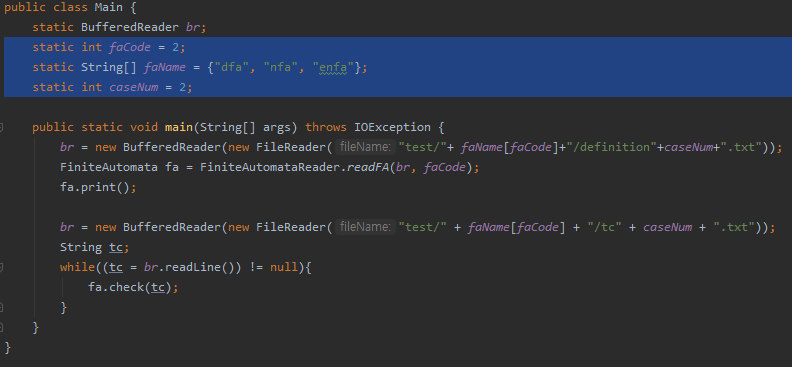
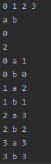
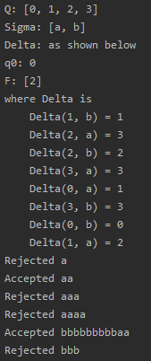
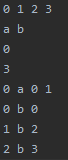
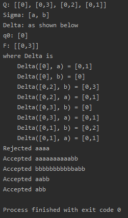
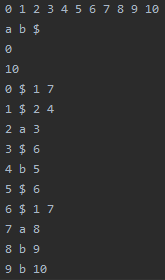
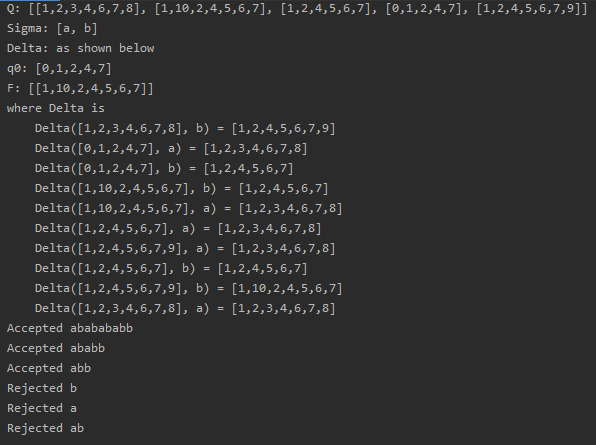

# DFA Converter

임의의 epsilon-NFA를 DFA로 변환하는 프로그램

### How to run app

- faCode 변수로 실행할 Finite Automata를 지정한다.

| faCode | Finite Automata |
|---|---|
| 0 | DFA |
| 1 | NFA |
| 2 | e-NFA |

- caseNum 변수로 테스트할 Finite Automata의 정의를 지정한다. (범위: 1~2)

### Screenshot

- DFA 테스트

- NFA 테스트 (NFA to DFA)

- e-NFA 테스트 (e-NFA to DFA)

